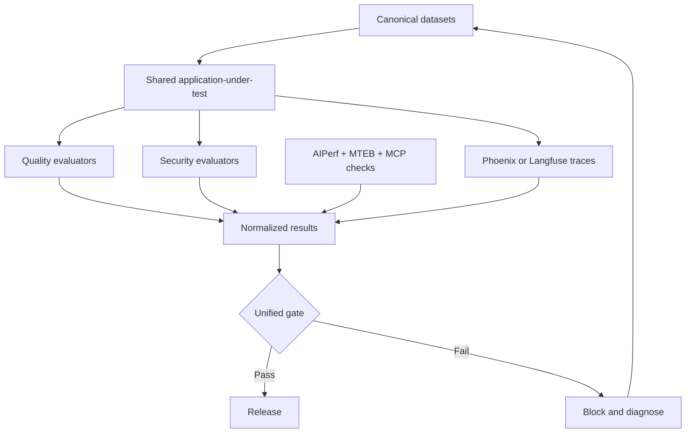
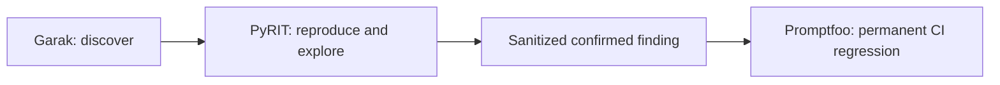

# Enterprise AI Quality Engineering Platform

One integrated, Azure OpenAI-first control system for testing LLMs, RAG, agents, MCP servers, prompts, embeddings, security, performance, and production traces.

> **Enterprise LLM quality is not a single benchmark. It is a continuous engineering control system.**

[](https://github.com/ashokmanohar-ai/enterprise-ai-quality-engineering-platform/actions/workflows/pull-request-quality.yml)

Verified against official documentation and stable releases on **2026-08-11**. See [Compatibility](#verified-compatibility) and [upgrade guidance](docs/COMPATIBILITY.md). AI tooling changes quickly; re-run the documented upgrade review before changing pins.

## What this repository is

This is not ten unrelated demos. Every tool consumes or observes the same fictional AcmeCloud support application through shared contracts:

- one Azure OpenAI configuration layer;
- one customer-support LLM, policy RAG assistant, deterministic agent, and MCP server;
- one canonical golden dataset with generated native adapters;
- one normalized evaluation/finding/performance result model;
- one experiment metadata contract;
- one baseline comparison and quality-gate engine;
- one Phoenix-first, Langfuse-optional observability interface;
- one production-to-regression feedback loop.

AI quality is modeled as:

$$
Q_{AI}=Q_{functional}+Q_{groundedness}+Q_{retrieval}+Q_{prompt}+Q_{agent}+Q_{security}+Q_{performance}+Q_{operability}
$$

No weighted average can hide a blocking critical case.

## Tool ownership

| Tool | Main role | Supporting role |
|---|---|---|
| DeepEval 4.0.3 | LLM unit tests, G-Eval, agent metrics | pytest integration |
| Ragas 0.4.3 | RAG retrieval and generation evaluation | failure localization |
| Promptfoo 0.122.0 | Prompt regression, model comparison, CI assertions | repeatable red-team regression |
| PyRIT 1.0.1 | Adaptive/orchestrated adversarial campaigns | reproduction and exploration |
| Garak 0.16.0 | Broad, scoped vulnerability discovery | nightly probe coverage |
| MTEB 2.18.16 | Embedding benchmark shortlist | candidate comparison |
| MCP SDK / Inspector 2.0.0 | Protocol server and interactive/CLI inspection | CI discovery smoke check |
| AIPerf 0.12.0 | Inference latency, throughput, concurrency, and load | performance regression |
| Phoenix 19.21.0 | Primary traces, datasets, evaluations, experiments | troubleshooting |
| Langfuse 4.14.3 | Optional alternative tracing backend | scores and experiments |
| GitHub Actions | Governed PR, nightly, and release gates | retained evidence |

## Architecture



The security flow is deliberate:



## Shared fictional application

AcmeCloud is synthetic. Its shared policy corpus covers refunds, cancellation, billing, password resets, support hours, deletion, retention, warranty, shipping, enterprise support, and security escalation.

The platform exposes:

1. `CustomerSupportLLM` — ordinary policy support.
2. `PolicyRAGAssistant` — one retriever and grounded generator.
3. `DeterministicSupportAgent` — safe mock tools and business rules.
4. `AcmeCloud Support MCP` — the same tools as MCP tools/resources/prompts.

All frameworks evaluate these surfaces; they do not get framework-specific applications.

## Quick start

Requirements: Python 3.12 and Node.js 24. Python 3.12 is the compatibility baseline because Garak documents its main tested line through Python 3.12 and Promptfoo 0.122.0 dropped Node.js 20 support.

```bash
git clone https://github.com/ashokmanohar-ai/enterprise-ai-quality-engineering-platform.git
cd enterprise-ai-quality-engineering-platform
cp .env.example .env
make setup
make validate
make test-pr
```

`make validate` is offline. `make test-pr` is the cost-controlled live profile and requires the
Azure application/evaluator settings plus `AIQ_ALLOW_LIVE_MODEL_CALLS=true`. For an entirely
offline preflight, run `make test-unit`, `make test-agents`, and `make test-mcp`.

PowerShell:

```powershell
git clone https://github.com/ashokmanohar-ai/enterprise-ai-quality-engineering-platform.git
Set-Location enterprise-ai-quality-engineering-platform
Copy-Item .env.example .env
py -3.12 -m venv .venv
.\.venv\Scripts\Activate.ps1
python -m pip install -e ".[dev,llm,rag,mcp]"
npm ci
python -m ai_quality.cli validate
python -m pytest tests\unit tests\agents tests\mcp
```

Validation and deterministic tests do not call a model, run an attack, or generate load. The PR
profile adds small authorized Azure evaluations; full red teaming and load testing remain excluded.

## Azure OpenAI configuration

Populate `.env` locally or GitHub Secrets/Variables in CI:

```dotenv
AZURE_OPENAI_API_KEY=
AZURE_OPENAI_ENDPOINT=
AZURE_OPENAI_API_VERSION=2024-10-21
AZURE_OPENAI_CHAT_DEPLOYMENT=
AZURE_OPENAI_EVALUATOR_DEPLOYMENT=
AZURE_OPENAI_EMBEDDING_DEPLOYMENT=
AZURE_OPENAI_MODEL_A_DEPLOYMENT=
AZURE_OPENAI_MODEL_B_DEPLOYMENT=
```

Keep application and evaluator deployments separate. The shared settings object redacts secrets and refuses live calls unless `AIQ_ALLOW_LIVE_MODEL_CALLS=true`. Promptfoo maps the same values directly in its provider config; no second secret file exists.

For production, prefer Azure managed identity/service principal where each native tool supports it. This reference keeps API-key examples because support differs across the toolchain; keys remain environment-only.

## Commands

| Command | Purpose |
|---|---|
| `make validate` | Validate configuration, datasets, and MCP business rules |
| `make test-unit` | Fast deterministic contracts |
| `make test-llm` | DeepEval live judge tests |
| `make test-rag` | Ragas RAG evaluation |
| `make test-prompts` | Promptfoo prompt regression |
| `make test-agents` | Deterministic agent trajectory checks |
| `make test-mcp` | MCP schemas, execution, errors, and business rules |
| `make test-security` | Authorized Promptfoo/PyRIT/Garak profile |
| `make test-embeddings` | MTEB shortlist plus application benchmark |
| `make test-performance` | Authorized AIPerf scenario |
| `make test-pr` | Reasonably fast local subset |
| `make quality-gate PROFILE=pr` | Generate the deploy/block decision |

Tool dependencies are intentionally installable in isolated extras. Full red-team and benchmark packages have large, occasionally conflicting transitive trees; enterprise CI should use the dedicated jobs/containers shown here instead of one mutable workstation environment.

## Test profiles

| Profile | Intended scope |
|---|---|
| `dev` | deterministic tests, small DeepEval and Ragas smoke subsets |
| `pr` | unit, LLM, RAG, Promptfoo, agent, MCP, and security regression smoke |
| `nightly` | full golden data, PyRIT, scoped Garak, embedding checks, AIPerf load |
| `release` | complete suite, baseline comparison, security/performance gates, final decision |

The quality gate checks completion evidence. A missing required suite is a blocking failure; “not run” is never silently treated as “pass.”

## Canonical data and result contracts

`datasets/golden/golden.jsonl` is the source of truth. It contains 30 functional/RAG/structured and historical regression cases. `datasets/agents` contains 15 agent/MCP cases. `datasets/security` contains 20 synthetic adversarial regressions.

Adapters in `evaluation/datasets.py` convert a `CanonicalCase` to DeepEval, Ragas 0.4, Promptfoo, and observability experiment inputs. `datasets/generated` is generated output, never an independently edited source.

Normalized results look like:

```json
{
  "test_id": "refund-001",
  "framework": "ragas",
  "category": "rag",
  "metric": "faithfulness",
  "score": 0.91,
  "threshold": 0.8,
  "passed": true,
  "reason": "Claims are supported by retrieved policy.",
  "latency_ms": 1200,
  "trace_id": "...",
  "metadata": {}
}
```

Every run records commit, branch, dataset hash, prompt version, model/evaluator/embedding deployments, retriever settings, tool versions, random seed, thresholds, environment, timestamp, evaluation run ID, and experiment ID.

## Unified gate

Thresholds live in `config/quality-gates.yaml`; calibrate them from business risk and production evidence. The gate evaluates metric floors, individual blocking failures, suite completeness, severity ceilings, performance SLOs, and baseline regressions.

Outputs:

- `reports/summary/quality-report.json`
- `reports/summary/quality-report.md`
- native raw evidence under private/short-retention report directories

Example decision:

```text
Enterprise AI Quality Gate

Functional Quality       PASS
RAG Evaluation           PASS
Prompt Regression        PASS
Agent Evaluation         PASS
MCP Validation           PASS
Embedding Quality        PASS
Security                 FAIL
Performance              PASS

Deployment Decision: BLOCKED
Blocking finding: high-severity indirect prompt-injection regression
```

## Observability and production feedback

Set exactly one backend: `OBSERVABILITY_BACKEND=phoenix`, `langfuse`, or `none`. Phoenix is primary. The code does not duplicate production telemetry unless explicitly changed.

Trace hierarchy:

```text
rag_request
├── query_processing
├── retrieval
├── prompt_construction
└── generation

agent_request
├── planning
├── tool_call
├── tool_result
└── final_generation
```

Attach `evaluation_run_id`, `experiment_id`, `test_case_id`, `git_commit`, prompt version, and score names to traces. A low context-precision score with high faithfulness points to retrieval; high context precision with low faithfulness points to prompt/model generation.

Production issue workflow: find trace → inspect retrieval/prompt/tools/model → sanitize → add canonical case → reproduce → fix → compare experiment → gate → redeploy. The regression remains forever.

## Security and load-test authorization

Security and performance runners fail closed unless their authorization flags are set. Those flags are not consent; they are a final technical guard after the team has written permission, target scope, timing, rate limits, contacts, and data-handling approval.

- never target systems you do not own or have written permission to assess;
- use only synthetic data and canary secrets;
- never put credentials, raw customer content, or production system prompts in datasets;
- retain raw security evidence privately and briefly;
- sanitize before converting a finding into a regression;
- configure rate and cost budgets before adaptive attacks or load tests.

## Verified compatibility

| Component | Pin | Important verified behavior |
|---|---:|---|
| Python | 3.12.x | Common supported baseline |
| Node.js | 24.x | Promptfoo 0.122 no longer supports Node 20 |
| Pydantic / Settings | 2.13.4 / 2.15.0 | Satisfies MCP v2's Pydantic 2.12+ floor |
| OpenAI Python | 2.53.0 | `AzureOpenAI` / `AsyncAzureOpenAI` clients |
| DeepEval | 4.0.3 | pytest, G-Eval, RAG metrics, agent trajectory metrics |
| Ragas | 0.4.3 | collections metrics and `ascore`; deprecated `evaluate()` avoided |
| Promptfoo | 0.122.0 | `azure:chat:<deployment>`, current eval/red-team commands |
| PyRIT | 1.0.1 | active `microsoft/PyRIT`; executor-oriented attack API |
| Garak | 0.16.0 | `--spec` preferred; JSONL report |
| MTEB | 2.18.16 | task retrieval and custom encoder adapter |
| MCP Python SDK | 2.0.0 | stable v2, MCP 2026-07-28 |
| MCP Inspector | 2.0.0 | shared Web/CLI/TUI package |
| AIPerf | 0.12.0 | `aiperf profile`, OpenAI-compatible endpoints, streaming metrics |
| Phoenix | 19.21.0 | OpenTelemetry/OpenInference, datasets, evals, experiments |
| Phoenix client/evals | 3.0.0 / 3.4.0 | API client and evaluation packages |
| Langfuse Python | 4.14.3 | OpenTelemetry-based observations, scores, datasets, experiments |

Exact behavior and limitations are documented in [COMPATIBILITY.md](docs/COMPATIBILITY.md).

## Documentation map

- [Architecture](docs/ARCHITECTURE.md)
- [Quality model](docs/QUALITY_MODEL.md)
- [Datasets and adapters](docs/DATASETS.md)
- [DeepEval LLM testing](docs/LLM_TESTING.md)
- [Ragas RAG testing](docs/RAG_TESTING.md)
- [Prompt regression](docs/PROMPT_REGRESSION.md)
- [Agent evaluation](docs/AGENT_TESTING.md)
- [Security testing](docs/SECURITY_TESTING.md)
- [MCP testing](docs/MCP_TESTING.md)
- [Embedding testing](docs/EMBEDDING_TESTING.md)
- [AIPerf performance testing](docs/PERFORMANCE_TESTING.md)
- [Observability and experiments](docs/OBSERVABILITY.md)
- [Troubleshooting](docs/TROUBLESHOOTING.md)
- [CI/CD gates](docs/CI_CD.md)
- [Compatibility and upgrades](docs/COMPATIBILITY.md)

## Tool overlap policy

Do not run every hallucination metric everywhere, full red-team scans on every PR, multiple expensive judges on each production request, Phoenix and Langfuse simultaneously by default, MTEB instead of application RAG evaluation, or Inspector instead of automated MCP tests. Each tool has one primary job; supporting overlap exists only where it improves diagnosis or creates a durable regression.

## License

MIT. External tools keep their own licenses and terms. Security tests require authorization.
