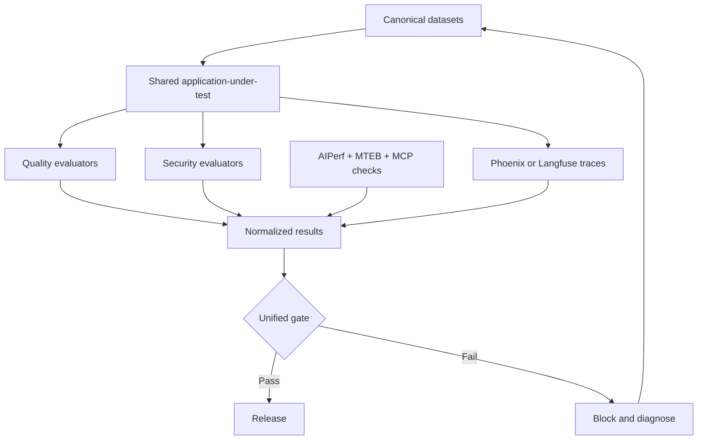
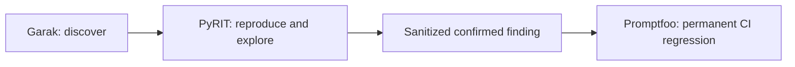

# Enterprise AI Quality Engineering Platform

**Ashok Kumar Manohar**  
**Test Architect | AI Quality Engineer | Forward Deployed AI Engineer | Agentic AI | RAG & LLM Evaluation | MCP | Playwright | API Automation | CI/CD**

> **Engineering Quality for the AI Era**

One integrated AI Quality Engineering and Assurance platform for testing LLMs, RAG systems, agents, MCP servers, prompts, embeddings, security, performance, human review, release readiness and production traces.

The goal is simple:

> **Can we prove that an AI system is reliable, safe, explainable, governed and ready for production?**

[](https://github.com/ashokmanohar-ai/enterprise-ai-quality-engineering-platform/actions/workflows/pull-request-quality.yml)

---

## Recruiter Quick Tour

This repository is the technical anchor for a wider **24-application AI Assurance portfolio** covering the full lifecycle:

**Data → RAG → Prompt → Model → Agent/MCP → Security → Evaluation → Human Review → Release → Observability → Incident Response → Governance**

### Start here

**Enterprise AI Quality Portfolio & Recruiter Showcase**  
https://enterprise-ai-quality-portfolio-recruiter-showcase-v700x0.v2.appdeploy.ai/

### Five-minute recruiter demo path

1. Portfolio Showcase
2. RAG Evaluation Workbench
3. Agent Identity, MCP & Tool Governance
4. AI Release Assurance & Governance
5. AI Observability & Production Monitoring
6. FHIR AI Quality Lab

The objective is not to show 24 dashboards. The objective is to show **one production AI assurance story**.

---

## Flagship Applications

### 1. AI Release Assurance & Governance Control Plane

https://ai-release-assurance-governance-control-plane-8414td.v2.appdeploy.ai/

Demonstrates:
- Policy-as-code release gates
- Quality and safety thresholds
- Human approval requirements
- Evidence bundles
- Canary readiness
- Rollback contracts
- Release certification
- Audit-ready decisions

**Engineering signal:** AI release governance, production assurance and CI/CD quality gates.

### 2. Agent Identity, MCP & Tool Governance Studio

https://agent-identity-mcp-tool-governance-studio-u3tp1t.v2.appdeploy.ai/

Demonstrates:
- Agent identity lifecycle
- MCP server attestation
- Tool permission scopes
- Delegated authorization
- Runtime policy decisions
- Human approval boundaries
- Policy violations
- Emergency revocation

**Engineering signal:** Agentic AI security, MCP governance and enterprise authorization.

### 3. RAG Evaluation Workbench

https://rag-evaluation-workbench-osc94p.v2.appdeploy.ai/

Demonstrates:
- Query-level retrieval traces
- Precision / Recall / MRR / NDCG
- Groundedness evaluation
- Hallucination-risk analysis
- Chunk attribution
- Failure clustering
- Hard-negative testing
- Baseline-vs-candidate regression
- Promotion eligibility

**Engineering signal:** RAG evaluation, LLM quality engineering and retrieval observability.

### 4. AI Observability & Production Monitoring Center

https://ai-observability-production-monitoring-center-8e6rp3.v2.appdeploy.ai/

Demonstrates:
- Trace-level observability
- Model/prompt/retriever/tool correlation
- SLO monitoring
- Error-budget burn
- Drift and anomaly signals
- Release markers
- Cost attribution
- Incident linkage
- Known-good baseline comparison

**Engineering signal:** Production AI reliability, observability and operational quality.

### 5. AI Red Team & Safety Evaluation Center

https://ai-red-team-safety-evaluation-center-okdouh.v2.appdeploy.ai/

Demonstrates:
- Adversarial test scenarios
- Safety evaluation
- Severity and exploitability scoring
- Remediation verification
- Regression packs
- Safety release gates

**Engineering signal:** AI safety engineering and adversarial quality assurance.

### 6. FHIR AI Quality Lab

https://fhir-ai-quality-lab-d56846.v2.appdeploy.ai/

Demonstrates:
- FHIR profile validation
- Terminology checks
- Reference and cardinality validation
- SMART-on-FHIR scope controls
- PHI handling evidence
- Clinical provenance
- Grounded clinical-summary evaluation
- Hallucination thresholds
- Healthcare regression packs
- Clinician-review boundaries

**Engineering signal:** Healthcare AI quality, interoperability and regulated-domain assurance.

---

## End-to-End Assurance Architecture

```text
Source Data
   ↓
Data Quality & Lineage
   ↓
RAG / Retrieval
   ↓
Prompt + Model
   ↓
Agent / MCP
   ↓
Security & Authorization
   ↓
Automated Evaluation
   ↓
Red Team / Safety
   ↓
Human Evaluation
   ↓
Release Gate
   ↓
Production Observability
   ↓
Incident Detection
   ↓
Forensics / Rollback
   ↓
Revalidation
   ↓
Governance Evidence
```

### Production evidence chain

```text
Requirement / Source
→ Document
→ Chunk
→ Retrieval
→ Prompt
→ Model
→ Agent
→ MCP Server
→ Tool
→ Authorization Decision
→ Evaluation
→ Safety Check
→ Human Approval
→ Release
→ Production Trace
→ Incident
→ RCA
→ Rollback
→ Revalidation
```

The target is a connected evidence model using a shared **System ID / Trace ID / Release ID**.

---

## What this Repository Proves

This is not a collection of disconnected framework demos. It models an enterprise AI-quality control system with shared contracts, shared datasets, normalized results, baseline comparison, governed release gates and production feedback.

AI quality is modeled as:

$$
Q_{AI}=Q_{functional}+Q_{groundedness}+Q_{retrieval}+Q_{prompt}+Q_{agent}+Q_{security}+Q_{performance}+Q_{operability}
$$

No weighted average should be allowed to hide a blocking critical case.

---

## Tool Ownership

| Tool | Main role | Supporting role |
|---|---|---|
| DeepEval | LLM unit tests, G-Eval, agent metrics | pytest integration |
| Ragas | RAG retrieval and generation evaluation | failure localization |
| Promptfoo | Prompt regression, model comparison, CI assertions | repeatable red-team regression |
| PyRIT | Adaptive adversarial campaigns | reproduction and exploration |
| Garak | Scoped vulnerability discovery | nightly probe coverage |
| MTEB | Embedding benchmark shortlist | candidate comparison |
| MCP SDK / Inspector | Protocol validation and tool inspection | CI discovery smoke check |
| AIPerf | Inference latency, throughput, concurrency and load | performance regression |
| Phoenix | Primary traces, datasets, evaluations and experiments | troubleshooting |
| Langfuse | Optional tracing backend | scores and experiments |
| GitHub Actions | Governed PR, nightly and release gates | retained evidence |

---

## Architecture



Security findings follow a deliberate lifecycle:



---

## Shared Fictional Application

The platform uses a synthetic AcmeCloud support application so evaluation evidence can be reproduced safely.

It includes:
1. `CustomerSupportLLM` — ordinary policy support.
2. `PolicyRAGAssistant` — one retriever and grounded generator.
3. `DeterministicSupportAgent` — safe mock tools and business rules.
4. `AcmeCloud Support MCP` — the same tools exposed as MCP tools/resources/prompts.

All frameworks evaluate the same application surfaces rather than framework-specific demos.

---

## Quick Start

```bash
git clone https://github.com/ashokmanohar-ai/enterprise-ai-quality-engineering-platform.git
cd enterprise-ai-quality-engineering-platform
cp .env.example .env
make setup
make validate
```

For an offline preflight, run:

```bash
make test-unit
make test-agents
make test-mcp
```

For governed live profiles, configure the documented Azure settings and explicit authorization flags first.

---

## Core Engineering Areas

### Agentic AI
- Agent evaluation
- Agent identity
- Delegated authorization
- MCP integration
- Tool governance
- Human-in-the-loop approval
- Runtime policy enforcement

### RAG & LLM Quality
- Retrieval quality
- Groundedness
- Hallucination detection
- RAG regression
- Golden datasets
- LLM-as-Judge
- Evaluation campaigns

### AI Governance
- Release gates
- Policy as code
- Risk controls
- Evidence bundles
- Audit trails
- Human review
- Model risk

### AI Reliability
- SLOs
- Error budgets
- Production traces
- Drift
- Incident detection
- Root-cause analysis
- Rollback and revalidation

### Test Automation
- Playwright
- API automation
- UI automation
- CI/CD
- BDD
- Parallel execution
- Evidence capture
- Reporting

---

## Wider AI Assurance Portfolio

The broader portfolio also includes:
- Human Evaluation & Annotation Operations Studio
- AI Supply Chain & Dependency Risk Studio
- AI Incident Response & Forensics Center
- AI FinOps & Token Economics Studio
- PromptOps & Prompt Evaluation Studio
- AI Data Quality & Lineage Control Center
- AI Model Risk & Compliance Studio
- AgentOps AI Reliability Studio
- AI Security Governance Center
- AgentOps & Agent Evaluation Studio
- AI Release Assurance Control Plane
- AI Evaluation Engineering Lab
- AI Assurance Platform Hub
- AI Evidence Assurance Passport
- AI Assurance Case Study
- AI Quality Evaluation Studio
- AI Quality Command Center

---

## Technical White Paper

**[Testing MCP-Powered AI Agents: Security, Authorization and Quality Engineering Patterns for Enterprise Tool-Connected AI](WHITEPAPER.md)**

The white paper covers MCP protocol and contract testing, authentication, authorization, scope escalation, tool risk classification, tool selection, trajectories, human approval, prompt injection, tool poisoning, tenant isolation, idempotency, observability, performance, regression datasets and CI/CD quality gates.

> **Core principle:** discovery is not permission. MCP must preserve authoritative application security boundaries, and trustworthy agent behavior must be proven from execution evidence—not final-response plausibility.

---

## Documentation Map

See the repository's `docs/` directory for detailed architecture, datasets, RAG, LLM, prompt, agent, MCP, security, performance, observability and troubleshooting documentation.

---

## Current Focus

I am especially interested in roles and projects involving:
- AI Quality Engineering
- AI Assurance
- Agentic AI
- Forward Deployed Engineering
- LLM / RAG Evaluation
- MCP and AI Agent Governance
- AI Observability
- AI Release Engineering
- AI Safety
- Healthcare AI Quality
- Test Architecture
- Playwright and API Automation

---

## Connect

**Ashok Kumar Manohar**  
Test Architect | AI Quality Engineer | Forward Deployed AI Engineer

**Engineering Quality for the AI Era**
