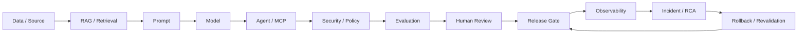

# Unified AI System Passport

The **AI System Passport** is the shared assurance record for a production AI system across data, retrieval, prompts, models, agents, MCP tools, evaluation, human review, release, observability and incident response.

It solves one portfolio and one enterprise problem: evidence is usually fragmented across evaluation tools, CI runs, release systems, observability traces and incident records. The passport creates one durable control record that answers:

> **What system ran, what evidence supported it, who approved it, what was released, what happened in production, and what changed after an incident?**

## End-to-end assurance chain



## Core identifiers

Every assurance component should preserve these identifiers wherever applicable:

| Field | Purpose |
| --- | --- |
| `system_id` | Stable identity of the AI product or service |
| `system_version` | Version of the deployable AI system |
| `release_id` | Release candidate / promoted release identifier |
| `trace_id` | Runtime request / execution trace |
| `evaluation_id` | Evaluation campaign or run |
| `dataset_id` | Golden / regression / adversarial dataset version |
| `prompt_version` | Prompt/template version |
| `model_version` | Model/deployment identifier |
| `retriever_version` | RAG index/retriever configuration |
| `agent_version` | Agent workflow/policy version |
| `policy_version` | Authorization, safety and release policy version |
| `incident_id` | Production incident or problem record |

The objective is correlation, not identifier proliferation. A runtime trace should be linkable back to the evaluated and released configuration.

## Passport schema

```yaml
passport_version: "1.0"

identity:
  system_id: "acme-support-ai"
  system_name: "Acme Support AI"
  system_version: "4.7.1"
  owner: "AI Platform Team"
  criticality: "high"
  environment: "production"

release:
  release_id: "rc-4.7.1"
  commit_sha: "<git-sha>"
  created_at: "<timestamp>"
  promoted_at: "<timestamp>"
  status: "certified"

components:
  data:
    dataset_id: "support-golden-v12"
    source_versions: []
    lineage_refs: []
    quality_status: "pass"

  rag:
    retriever_version: "rag-v23"
    index_version: "index-v23"
    embedding_model: "<embedding-model>"
    chunking_version: "chunk-v8"
    retrieval_eval_id: "eval-rag-2026-09-13"
    retrieval_metrics:
      precision_at_k: null
      recall_at_k: null
      mrr: null
      ndcg: null
    groundedness: null
    hallucination_risk: null

  prompt:
    prompt_version: "prompt-v12"
    template_hash: "<sha256>"
    policy_refs: []

  model:
    model_version: "<deployment/model>"
    provider: "<provider>"
    evaluator_model_version: "<evaluator>"

  agent:
    agent_version: "agent-v9"
    mcp_servers: []
    tools: []
    delegated_purpose: "customer-support"
    tool_policy_version: "tool-policy-v5"

security:
  authorization_decision_id: "authz-123"
  requester_identity: "<principal>"
  agent_identity: "<agent-principal>"
  least_privilege_status: "pass"
  confused_deputy_check: "pass"
  policy_violations: []
  red_team_campaign_id: "redteam-2026-09"

quality:
  evaluation_id: "eval-2026-09-13-001"
  dataset_id: "release-regression-v14"
  functional_status: "pass"
  safety_status: "pass"
  groundedness_status: "pass"
  agent_task_success_status: "pass"
  performance_status: "pass"
  blocking_findings: []

human_review:
  required: true
  reviewer: "<reviewer>"
  decision: "approved"
  reviewed_at: "<timestamp>"
  rationale: "<review rationale>"

release_gate:
  policy_version: "high-assurance-v3"
  gate_status: "pass"
  evidence_bundle_id: "bundle-rc-4.7.1"
  rollback_plan_id: "rollback-4.7.1"

observability:
  production_trace_ids: []
  slo_status: "healthy"
  drift_status: "within-threshold"
  cost_status: "within-budget"

incident:
  incident_ids: []
  active_critical_incident: false
  last_incident_id: null
  root_cause_ref: null
  rollback_executed: false
  revalidation_id: null

assurance:
  overall_status: "release-ready"
  residual_risks: []
  exceptions: []
  evidence_refs: []
```

## Required control domains

A passport is considered complete only when the relevant domains are present and their evidence is traceable.

### 1. Data and lineage

Evidence should answer:

- Which documents, datasets and versions were used?
- What transformations, filtering or chunking happened?
- Was tenant/project scope preserved?
- Can a generated claim be traced back to an authorized source?

### 2. RAG and retrieval

Evidence should preserve:

- query
- candidate and final ranked chunks
- source/chunk IDs
- similarity/ranking scores
- expected relevant documents
- Precision@K, Recall@K, MRR and NDCG where applicable
- context sufficiency
- groundedness
- hallucination/citation failure evidence
- regression asset created from failures

### 3. Prompt and model

The passport should retain:

- prompt/template version and hash
- model/deployment identifier
- evaluator model identifier when model judges are used
- provider configuration without secrets
- token, latency and cost values only when actually reported

### 4. Agent and MCP governance

For agentic systems, capture:

- requester identity
- agent identity
- delegation chain
- MCP server identity/attestation
- selected tool and arguments
- delegated purpose
- allowed scope
- trust boundary
- approval boundary
- runtime authorization decision
- policy violations and emergency revocation evidence

Recommended chain:

`Requester → Agent → MCP Server → Tool → Purpose → Scope → Policy → Approval → Runtime Result`

### 5. Evaluation and safety

Evaluation should preserve the evidence that produced the release decision, not only an aggregate score.

Examples:

- functional/correctness results
- RAG metrics
- groundedness and hallucination results
- agent task/tool/trajectory results
- prompt regressions
- adversarial/red-team findings
- performance/SLO evidence
- human evaluation/adjudication
- blocking failures

A critical safety or authorization failure must remain blocking even if a weighted aggregate is high.

### 6. Human review

High-impact releases and consequential agent actions should record:

- whether approval was required
- reviewer identity
- decision
- evidence reviewed
- rationale
- timestamp
- artifact/release hash the approval was bound to

### 7. Release assurance

Release evidence should correlate:

`Evaluation → Risk → Human Approval → CI/CD Gate → Evidence Bundle → Rollback Plan → Promotion → Certification`

The release gate should fail closed when required evidence is missing.

### 8. Production observability

Runtime traces should preserve enough version metadata to answer:

- Which model/prompt/retriever/agent handled this request?
- Which tools were called?
- Which sources were retrieved?
- Which release produced the behavior?
- Which SLO, drift, error, token or cost signals changed?

### 9. Incident and revalidation

Incident evidence should support:

`Alert → Triage → Trace → Release Marker → Blast Radius → RCA → Containment → Rollback → Regression Asset → Revalidation → Restore/Hold`

The passport should be updated, not replaced, so post-incident evidence becomes part of the system history.

## Release-readiness rule

A simple deterministic posture can be expressed as:

```text
RELEASE_READY =
  required_evidence_complete
  AND no_blocking_quality_failure
  AND no_blocking_safety_failure
  AND authorization_controls_pass
  AND human_approval_satisfied
  AND rollback_plan_present
  AND no_active_critical_incident
```

Weighted scores may inform risk, but they must not override blocking controls.

## Cross-project mapping

The passport intentionally joins evidence produced by the flagship portfolio:

| Passport domain | Portfolio evidence source |
| --- | --- |
| Enterprise quality gate | Enterprise AI Quality Engineering Platform |
| UI/API deterministic automation | Playwright Enterprise Test Framework |
| Agent workflow governance | Agentic Quality Engineering Platform |
| RAG quality | RAG & LLM Evaluation Lab / RAG Evaluation Workbench |
| Agent behavior evaluation | AI Agent Evaluation Framework |
| API/distributed-system assurance | API & Integration Testing Framework |
| Agent/MCP authorization | Agent Identity, MCP & Tool Governance Studio |
| Red-team/safety | AI Red Team & Safety Evaluation Center |
| Human review | Human Evaluation & Annotation Operations Studio |
| Release certification | AI Release Assurance & Governance Control Plane |
| Production telemetry | AI Observability & Production Monitoring Center |
| Incident evidence | AI Incident Response & Forensics Center |
| Healthcare assurance | FHIR AI Quality Lab |

## Recruiter narrative

A recruiter or engineering leader should be able to start from a single release and drill through:

1. **What was built?** — system/version/commit.
2. **What knowledge did it use?** — data/RAG lineage.
3. **What model, prompt and agent executed?** — component versions.
4. **What was it allowed to do?** — MCP/tool authorization and purpose.
5. **How was it evaluated?** — functional, RAG, agent, safety and performance evidence.
6. **Who approved it?** — human review and release policy.
7. **What went to production?** — release/certification record.
8. **What happened after release?** — traces, SLOs, drift and incidents.
9. **What did the incident teach the system?** — regression asset, rollback and revalidation.

That is the core AI Assurance story:

> **Do not test only the output. Preserve enough evidence to explain and govern the entire AI system lifecycle.**

## Implementation guidance

The passport can be stored as JSON/YAML for portability and mirrored in a database for queryability. Production implementations should additionally consider:

- immutable versioned passport revisions
- signed evidence bundles / provenance hashes
- access control around sensitive evidence
- links rather than duplicated PHI/PII/raw prompts where retention is restricted
- policy-as-code validation in CI/CD
- automatic correlation from OpenTelemetry attributes
- incident-to-regression automation
- release diff views between passport revisions

The reference schema is deliberately provider-neutral and framework-neutral so it can correlate Azure OpenAI, OpenAI-compatible providers, local models, managed vector stores, MCP servers and standard software test evidence without changing the assurance model.
