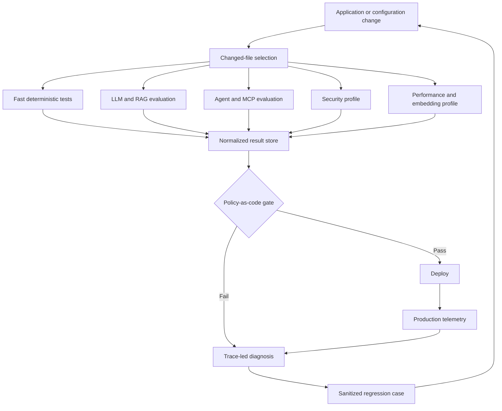

# Architecture

## System boundary

The platform evaluates one AcmeCloud application, not framework-specific sample apps. Application interfaces produce answer, context, tool trajectory, latency, token usage, sources, and trace correlation. Native adapters translate the canonical input/result contracts at the boundary.

`ApplicationUnderTest.invoke(AUTRequest) -> AUTResponse` is the shared async boundary. Concrete wrappers expose the customer-support LLM, RAG assistant, deterministic agent, and MCP-enabled agent with the same output shape; framework adapters consume that shape rather than constructing alternate applications.

## Layers

| Layer | Responsibility |
|---|---|
| Configuration | Secrets, providers, profiles, thresholds, budgets, authorization |
| Applications | LLM, RAG, agent, MCP-enabled agent |
| Retrieval | Knowledge loading, embedding provider, vector store, top-k |
| Evaluation | Canonical adapters and native tool runners |
| Security | Discovery, reproduction, normalization, regression promotion |
| Performance | AIPerf execution and SLO normalization |
| Observability | Exactly one selected trace backend |
| Experiments | Prompt/model/embedding/RAG/agent comparisons and metadata |
| Reporting | Normalization, baseline delta, quality gate, Markdown/JSON |

## Invariants

- Golden data is canonical and versioned by content hash.
- Generated tool-native datasets are not edited by hand.
- Raw outputs are retained separately from normalized, reviewable results.
- Every live run records the evaluator deployment independently from the application deployment.
- A critical individual failure can block regardless of averages.
- Required suite absence is a failure.
- Security and performance runners fail closed without explicit authorization flags.
- Production traces go to Phoenix or Langfuse, never both by default.

## Test pyramid

From fastest/cheapest to slowest/most expensive: deterministic unit → LLM unit → prompt regression → RAG → agent/MCP → embedding → security smoke → performance smoke → full red team → load/stress/soak.

PRs stay near the top; nightly and release workflows own the expensive lower layers.

## Feedback loops

Production: complaint/low score → correlated trace → localize retrieval/prompt/model/tool → sanitize → golden case → fix → experiment → gate → redeploy.

Security: scan → reproduce → confirm → fix → security dataset → Promptfoo PR regression.

Performance: production/load regression → slow trace → localize retrieval/LLM/tool bottleneck → AIPerf comparison → SLO gate.
