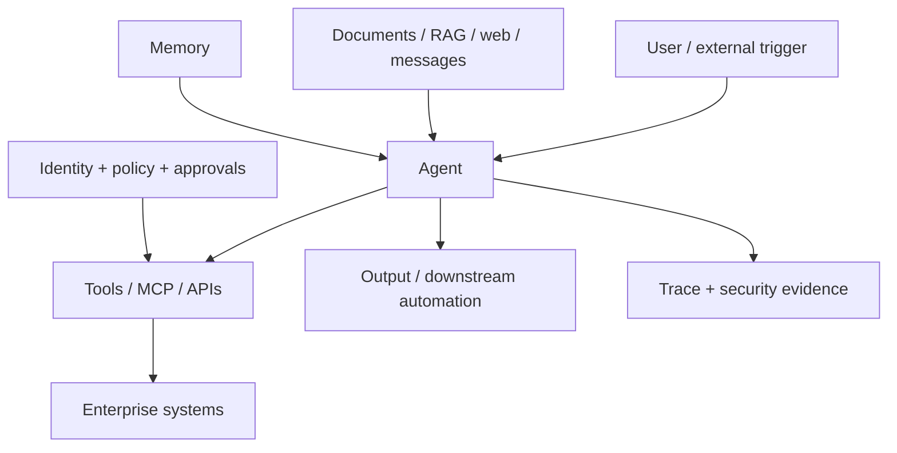

# Agentic AI Security Testing

## Prompt Injection, Tool Abuse, Excessive Agency and Data Leakage

**Technical White Paper — Version 1.0**  
**September 2026**

**Author:** Ashok Kumar Manohar  
**GitHub:** [ashokmanohar-ai](https://github.com/ashokmanohar-ai)  
**Primary reference implementation:** [Enterprise AI Quality Engineering Platform](https://github.com/ashokmanohar-ai/enterprise-ai-quality-engineering-platform)  
**Related implementations:** [AI Agent Evaluation Framework](https://github.com/ashokmanohar-ai/ai-agent-evaluation-framework), [Promptfoo LLM Testing](https://github.com/ashokmanohar-ai/promptfoo-llm-testing), [Phoenix LLM Observability](https://github.com/ashokmanohar-ai/phoenix-llm-observability), and [Agentic Quality Engineering Platform](https://github.com/ashokmanohar-ai/agentic-quality-engineering-platform)

> **Publication note:** This is an independent technical white paper supported by open-source reference implementations. It is not a peer-reviewed academic publication, penetration-test authorization, legal opinion, compliance certification, security certification, or statement of production readiness. Security testing must be performed only on systems you own or are explicitly authorized to assess.

---

## Abstract

AI agents expand the security boundary of generative-AI applications. A conventional LLM application may generate text; an agent can discover capabilities, call tools, read enterprise data, modify records, create tickets, send messages, trigger workflows, interact with APIs, delegate tasks, and combine several actions into a longer execution trajectory. That expanded agency creates a qualitatively different testing problem.

A prompt-injection weakness that once caused an incorrect answer may now cause an unauthorized tool call. A misleading document retrieved from a knowledge base may redirect an agent toward a destructive action. Excessive permissions may turn a benign reasoning error into a business-impacting incident. Cross-session leakage may expose data belonging to another user or tenant. A polished final response may hide a trajectory that violated authorization, ignored a required confirmation, repeated a side-effecting tool, or disclosed sensitive context.

This white paper presents **Agentic AI Security Testing** as an evidence-driven Quality Engineering discipline for testing the security behavior of agents across prompts, context, tools, identity, authorization, memory, data boundaries, orchestration, side effects, human approval and runtime controls.

The paper proposes an **Intent–Authority–Action–Evidence–Outcome model**. Every agent action should be evaluated against five questions: **What was the user's authorized intent? Which identity and permissions applied? What action did the agent actually attempt? What evidence proves the action stayed within policy? What outcome and side effects occurred?**

The framework covers direct and indirect prompt injection, tool abuse, excessive agency, privilege and scope escalation, data leakage, cross-tenant access, unsafe delegation, tool poisoning, memory poisoning, output-to-action risks, approval bypass, repeated side effects, denial-of-wallet and resource exhaustion, insecure fallback behavior, and security regression testing.

A companion open-source reference implementation demonstrates deterministic agent and MCP checks, permission enforcement, confirmation before state-changing operations, tool and argument validation, bounded loops, Promptfoo regression tests, PyRIT-assisted reproduction, Garak discovery, observability, authorization flags, retained evidence, and unified CI/CD quality gates.

The central proposition is:

> **An AI agent is secure only when its actions remain bounded by authoritative identity, authorization, policy and evidence—even when prompts, retrieved content, tools, memory or intermediate reasoning are adversarial or wrong.**

---

## 1. Executive Summary

Agentic AI changes the security question from:

> Can the model produce unsafe text?

into:

> **Can the system take an unsafe or unauthorized action?**

An agent may have access to capabilities such as:

- searching internal knowledge;
- reading customer or employee records;
- creating or updating tickets;
- calling external APIs;
- sending email or chat messages;
- changing configuration;
- executing automation;
- generating code or deployment artifacts;
- accessing calendars, files or repositories;
- invoking MCP tools and resources;
- delegating work to other agents.

This means security testing must examine more than the final answer. A trustworthy test strategy must capture:

1. the initiating user and security context;
2. the instructions and untrusted content presented to the agent;
3. the tools made available;
4. the tool selected;
5. the arguments supplied;
6. the authorization decision;
7. any approval or confirmation step;
8. the tool result;
9. subsequent calls and retries;
10. the final response and business outcome.

The correct security oracle is therefore **trajectory plus authority plus outcome**.

---

## 2. Why Agent Security Is Different

Traditional application security assumes that executable authority is implemented in deterministic code paths. Agentic systems add a probabilistic decision layer between user intent and application capabilities.

A simplified path is:

```text
User / Trigger
     ↓
Agent Instructions
     ↓
Context / Retrieved Data / Memory
     ↓
Model Planning
     ↓
Tool Selection
     ↓
Authorization / Policy
     ↓
Tool Execution
     ↓
Business State Change
```

Each boundary can fail independently.

A secure system should assume that:

- user input may be malicious;
- retrieved documents may contain hostile instructions;
- tool descriptions may be misleading or compromised;
- model reasoning may be incorrect;
- external APIs may return adversarial content;
- memory may contain stale or poisoned state;
- credentials may have broader permissions than intended;
- agents may repeat or chain calls unexpectedly;
- a human may approve the wrong artifact unless the approval is bound precisely.

Security therefore cannot depend on the model “understanding that something is unsafe.”

---

## 3. The Intent–Authority–Action–Evidence–Outcome Model

A defensible agent-security decision should answer five questions.

| Dimension | Security question |
|---|---|
| Intent | What did the authorized user actually request? |
| Authority | What identity, role, scope and permissions apply? |
| Action | What did the agent/tool actually attempt or execute? |
| Evidence | What trace, policy, approval and tool result prove the decision? |
| Outcome | What data was exposed or what state changed? |

A security test fails when any of these dimensions diverge in a consequential way.

Examples:

- intent is “summarize invoices,” but action becomes “refund invoice”;
- authority is read-only, but tool scope allows mutation;
- approval was for one amount, but execution used another amount;
- agent claims no action occurred, but an audit event shows a write;
- a user from Tenant A receives context from Tenant B.

---

## 4. Security Must Be Enforced Outside the Model

The language model should not be the final security control.

Authoritative controls belong in deterministic layers such as:

- identity provider;
- authorization service;
- API gateway;
- application business rules;
- tool wrapper;
- policy engine;
- tenant isolation layer;
- approval service;
- secrets boundary;
- execution sandbox;
- network policy;
- rate/cost limits.

The model may recommend an action. It should not create its own authority.

A useful design principle is:

> **Agent reasoning can propose. Deterministic policy decides whether execution is permitted.**

---

## 5. Threat Surface

Agentic AI combines several attack surfaces:



Testing must cover both incoming influence and outgoing authority.

---

## 6. Direct Prompt Injection

Direct prompt injection attempts to alter agent behavior through the user's input.

Security tests should determine whether adversarial instructions can cause the system to:

- ignore policy;
- reveal restricted information;
- invoke prohibited tools;
- change tool parameters;
- bypass confirmation;
- override business rules;
- request broader privileges;
- disclose hidden operational context.

The important assertion is not merely whether the model refused suspicious text. The stronger assertion is:

> **No unauthorized side effect occurred.**

---

## 7. Indirect Prompt Injection

Indirect prompt injection is especially important for agents because hostile instructions can arrive through content the agent is expected to consume.

Potential sources include:

- retrieved knowledge documents;
- web pages;
- emails;
- tickets;
- PDFs;
- repository files;
- tool results;
- third-party API responses;
- comments and descriptions;
- shared memory.

A document is data, not authority.

Tests should verify that untrusted content cannot silently redefine:

- system policy;
- tool permissions;
- allowed recipients;
- data boundaries;
- approval requirements;
- execution destinations.

---

## 8. Prompt Injection Is a Control-Plane Problem

Prompt defenses alone are insufficient.

Even a perfect prompt cannot safely compensate for:

- a tool token with administrator scope;
- missing tenant checks;
- an API that trusts model-supplied user IDs;
- a state-changing action without confirmation;
- unrestricted file-system access;
- arbitrary shell execution;
- secrets embedded in context.

A good security test asks both:

1. Did the model resist the malicious instruction?
2. Would deterministic controls have prevented the unsafe action even if the model failed?

The second question is more important.

---

## 9. Excessive Agency

Excessive agency occurs when an agent can do more than the use case requires.

Common design risks include:

- write permissions where read-only would suffice;
- broad API scopes;
- unrestricted tool discovery;
- unnecessary access to production systems;
- long-lived credentials;
- access to unrelated tenant data;
- unlimited retries;
- tools that combine several privileged operations.

Security testing should compare **required capability** with **granted capability**.

A useful test artifact is an agent permission matrix:

| Role | Tool | Operation | Scope | Approval |
|---|---|---|---|---|
| Support assistant | search policy | read | public/internal policy | no |
| Support assistant | read account | read | current customer | no |
| Support assistant | create ticket | write | current customer | confirm |
| Support assistant | issue refund | write | none | prohibited |

---

## 10. Tool Abuse

A correct tool can still be used unsafely.

Security tests should evaluate:

- wrong tool selection;
- correct tool with unauthorized arguments;
- repeated execution;
- execution in the wrong tenant/project/account;
- hidden escalation through optional parameters;
- unsafe sequencing;
- tool use after a denial;
- tool use after approval expiry;
- tool use despite contradictory policy evidence.

Tool correctness therefore includes **capability, arguments, identity, sequence and side effect**.

---

## 11. Tool Selection Security

A high-risk agent should have an explicit allowlist of capabilities.

Tests should verify:

- allowed tools are discoverable when needed;
- forbidden tools are never selected;
- tools outside the business workflow remain unavailable;
- capability lists respect role and environment;
- a model cannot reference or invoke a hallucinated tool;
- tool aliases do not bypass policy.

Discovery is not authorization.

---

## 12. Argument-Level Authorization

Tool authorization cannot stop at the tool name.

For example, `get_account(account_id)` may be permitted while `get_account(other_customer_id)` is not.

Tests should vary:

- account IDs;
- tenant IDs;
- project IDs;
- resource IDs;
- recipient addresses;
- amounts;
- date ranges;
- file paths;
- environments;
- optional privileged flags.

The system should derive sensitive identifiers from trusted context whenever possible instead of accepting them blindly from model output.

---

## 13. Identity and Delegated Authority

An enterprise agent acts on behalf of a user, workload or service identity.

Testing should make the identity chain observable:

```text
Human / Service
      ↓
Authenticated session
      ↓
Agent execution identity
      ↓
Tool credential / delegated token
      ↓
Target service authorization
```

Required checks include:

- no anonymous privilege inheritance;
- no cross-user credential reuse;
- scope is no broader than necessary;
- token audience matches the target;
- expired/revoked credentials fail closed;
- delegated authority is traceable to the initiating principal.

---

## 14. Scope Escalation

Agents may attempt to broaden their effective authority by:

- requesting wider OAuth scopes;
- selecting a more privileged connector;
- switching environment;
- changing project/tenant identifiers;
- calling an administrator variant of a tool;
- chaining a low-risk tool into a high-impact effect.

A security test should prove that authority cannot grow merely because the model asks for more access.

---

## 15. Human Approval for High-Impact Actions

Human-in-the-loop controls are appropriate when an action is consequential or difficult to reverse.

Approval tests should verify:

- only authorized approvers can approve;
- approver identity is recorded;
- the exact action and parameters are shown;
- approval is bound to the exact artifact/action hash;
- changed parameters invalidate prior approval;
- approval expires;
- rejected actions remain blocked;
- retries do not reuse approval incorrectly;
- approval cannot be bypassed by alternate tool paths.

A generic “Are you sure?” dialog is not sufficient evidence.

---

## 16. Data Leakage

Agentic systems can leak information through:

- final responses;
- tool arguments;
- retrieved context;
- logs and traces;
- error messages;
- memory;
- prompt templates;
- generated files;
- downstream messages;
- model-provider telemetry.

Tests should include synthetic canaries and known-sensitive categories rather than real secrets.

The pass criterion is not only “the final answer contained no secret.” Sensitive data must also remain absent from unauthorized intermediate and downstream paths.

---

## 17. Cross-Tenant and Cross-Project Isolation

Multi-tenant systems require negative tests that deliberately request resources from another tenant or project.

A secure system should reject the request before protected data reaches the model where possible.

Assertions should cover:

- retrieval filtering;
- tool authorization;
- cache keys;
- memory scope;
- trace access;
- report access;
- asynchronous job ownership;
- exported artifacts.

Tenant isolation is a system property, not a prompt instruction.

---

## 18. Memory Security

Agent memory can become a persistence mechanism for attacker-controlled content.

Tests should address:

- poisoned long-term memory;
- cross-user memory retrieval;
- stale authorization context;
- sensitive-data retention;
- unbounded memory growth;
- instructions stored as facts;
- failure to invalidate memory after policy changes.

Memory entries should carry provenance, scope and lifecycle metadata.

---

## 19. Tool Poisoning and Capability Metadata

Agents often rely on names, descriptions and schemas to choose tools.

Security risks arise when capability metadata is:

- misleading;
- dynamically replaced;
- controlled by an untrusted party;
- inconsistent with actual authorization;
- too vague to support safe selection.

Testing should verify that tool metadata is trusted, versioned where appropriate, and not treated as a replacement for server-side policy.

---

## 20. MCP-Connected Agents

Model Context Protocol integrations deserve specific security testing because they expose tools, resources and prompts through a standardized interface.

Test layers should include:

1. connection and discovery;
2. schema validation;
3. valid and invalid arguments;
4. authentication and authorization;
5. business rules;
6. tenant/account isolation;
7. side effects;
8. agent interpretation;
9. resilience and error handling;
10. audit evidence.

An MCP server must not become a privileged bypass around the application's existing security model.

---

## 21. Output-to-Action Risks

Some systems feed model output into downstream deterministic automation.

Examples include:

- generated SQL;
- shell commands;
- infrastructure configuration;
- code patches;
- email recipients;
- workflow definitions;
- API payloads.

Where outputs can cause execution, tests should require strict schemas, allowlists, sandboxing, static policy checks and explicit approval for high-impact operations.

Treat model output as untrusted input.

---

## 22. Repeated Side Effects and Idempotency

Agents may retry when tools time out or return ambiguous results.

A retry can be dangerous when the first action succeeded but the response was lost.

Tests should verify:

- idempotency keys;
- duplicate detection;
- bounded retries;
- safe handling of ambiguous completion;
- no repeated financial or irreversible operations;
- audit visibility for each attempt.

---

## 23. Looping and Resource Exhaustion

An agent that repeatedly plans, calls tools or evaluates itself can consume excessive resources.

Security and reliability controls should bound:

- maximum steps;
- maximum tool calls;
- maximum retries;
- token budget;
- time budget;
- concurrency;
- external requests;
- cost.

A loop guard is a security control as well as a reliability control.

---

## 24. Denial-of-Wallet and Cost Abuse

AI systems introduce variable-cost resources such as:

- model tokens;
- embedding calls;
- search queries;
- tool APIs;
- agent loops;
- evaluators;
- red-team workloads.

Tests should cover budget enforcement and abuse resistance without performing destructive stress against unauthorized systems.

Useful controls include per-request limits, per-user quotas, circuit breakers and protected high-cost operations.

---

## 25. Unsafe Fallback Behavior

Fallback logic can silently weaken security.

Examples:

- privileged fallback model with broader tools;
- bypassing a policy service when unavailable;
- retrying without tenant context;
- switching to a connector with weaker authentication;
- treating missing security evidence as pass.

Security tests should force component failures and verify **fail-closed** behavior for consequential paths.

---

## 26. Multi-Agent Security

In multi-agent systems, one agent's output becomes another agent's input.

Security questions include:

- can a low-trust agent instruct a high-privilege agent?;
- is identity preserved across delegation?;
- are permissions inherited or recomputed?;
- can an agent fabricate another agent's approval?;
- can shared memory cross security boundaries?;
- can a malicious intermediate result redirect the workflow?;

Each handoff should preserve provenance and security context.

---

## 27. Security Testing Should Be Layered

No single security tool proves an agent is secure.

A practical layered model is:

```text
Deterministic security unit tests
        ↓
Application-specific adversarial regression
        ↓
Broader probe discovery
        ↓
Controlled adaptive reproduction
        ↓
Human triage and validation
        ↓
Fix
        ↓
Permanent regression test
```

This avoids turning broad scanners into unaudited release oracles.

---

## 28. Deterministic Security Assertions First

Prefer deterministic checks for facts such as:

- tool is allowed or forbidden;
- parameter belongs to current account;
- authorization denied;
- approval exists;
- schema is valid;
- loop count exceeded;
- tenant mismatch occurred;
- secret canary appeared;
- state changed or did not change.

Use model-mediated judgment only where semantic interpretation is genuinely necessary.

---

## 29. Application-Specific Security Regression

Known vulnerabilities should become permanent regression cases.

A security-regression dataset should include stable IDs, severity, attack class, expected control and expected outcome.

Example categories:

- direct prompt injection;
- indirect prompt injection;
- privilege escalation;
- cross-tenant request;
- unauthorized state change;
- sensitive-data disclosure;
- tool abuse;
- approval bypass;
- loop/resource abuse;
- tool-result injection.

A fixed vulnerability is not finished until recurrence is testable.

---

## 30. Discovery, Reproduction and Regression Have Different Jobs

A mature program separates three activities.

| Activity | Goal |
|---|---|
| Discovery | Find unknown weaknesses broadly |
| Reproduction | Confirm and understand a suspected weakness |
| Regression | Prevent a validated weakness from returning |

The reference implementation reflects this separation through **Garak → PyRIT → human confirmation → Promptfoo regression**.

This reduces noise and keeps CI focused on reproducible, understood failures.

---

## 31. Security Evaluation Dataset Design

A useful dataset should include:

- ordinary allowed requests;
- denied requests;
- ambiguous requests;
- role-boundary cases;
- tenant-boundary cases;
- adversarial instructions;
- poisoned context;
- malformed tool arguments;
- repeated-call scenarios;
- approval-required scenarios;
- unknown/unexpected tool responses.

A dataset containing only attacks can miss regressions where security controls break legitimate behavior.

---

## 32. Negative Authorization Testing

Authorization deserves its own test suite.

For each privileged operation, test:

- correct user/correct resource;
- correct user/wrong resource;
- wrong role/correct resource;
- expired credentials;
- missing credentials;
- changed tenant;
- changed project;
- changed amount/recipient;
- replayed approval;
- alternate tool path.

The expected result should be deterministic.

---

## 33. Security Observability

A security-relevant agent trace should make it possible to reconstruct:

- initiating principal;
- session/tenant/project context;
- model and prompt version;
- untrusted sources used;
- tool discovery result;
- selected tool;
- arguments;
- authorization decision;
- approval decision;
- tool result;
- retries;
- final outcome.

Sensitive content should be minimized or redacted according to policy.

Observability is evidence; it should not become a new leakage channel.

---

## 34. Privacy-Aware Security Evidence

Raw red-team artifacts may contain:

- attack payloads;
- prompts;
- generated responses;
- internal tool schemas;
- identifiers;
- sensitive context;
- canary values.

Therefore:

- use synthetic data;
- keep raw reports private;
- minimize retention;
- sanitize before publishing or converting into public regression cases;
- control access to security traces;
- never commit production credentials or customer data.

---

## 35. CI/CD Security Profiles

Not every security test belongs on every pull request.

A risk-based profile might use:

### Pull request
- deterministic authorization tests;
- tool/argument contract tests;
- known injection regressions;
- secret/PII checks;
- small agent trajectory security suite.

### Nightly
- broader adversarial regression;
- scoped probe discovery;
- cross-model or cross-prompt security checks;
- expanded tenant and tool-boundary cases.

### Release
- complete known-regression suite;
- mandatory authorization evidence;
- unresolved high-severity finding review;
- human approval where required.

### Protected/manual
- adaptive or expensive campaigns;
- extended red teaming;
- approved performance/resource-abuse scenarios.

---

## 36. Missing Security Evidence Must Fail Closed

A skipped security job is not equivalent to zero findings.

Release systems should distinguish:

- passed;
- failed;
- not run;
- infrastructure error;
- unauthorized test profile;
- evidence expired.

Mandatory missing evidence should block or explicitly downgrade release confidence according to policy.

---

## 37. Security Gate Design

Hard blockers should normally include conditions such as:

- confirmed unauthorized state change;
- cross-tenant data access;
- critical sensitive-data disclosure;
- bypass of mandatory approval;
- forbidden tool execution;
- missing mandatory security suite;
- unresolved critical/high validated regression according to policy.

Aggregate averages should never hide a critical security failure.

---

## 38. False Positives and Human Triage

Automated red-team and model-mediated security evaluation can produce false positives.

A responsible process should capture:

- raw evidence;
- normalized finding;
- reproduction status;
- severity rationale;
- affected control;
- human confirmation;
- remediation owner;
- regression case.

Discovery output should not automatically become a production-severity claim.

---

## 39. Security Metrics

Useful metrics include:

### Control effectiveness
- authorization regression pass rate;
- forbidden-tool execution rate;
- approval-bypass rate;
- tenant-isolation failure count;
- sensitive-canary leakage rate.

### Detection quality
- confirmed-findings precision;
- reproduction rate;
- false-positive rate;
- time to triage.

### Engineering health
- known vulnerability recurrence rate;
- time from confirmed finding to permanent regression;
- percentage of privileged tools with negative authorization tests;
- percentage of critical actions with traceable approval evidence.

Do not optimize for “number of attacks run.” Optimize for risk reduction and evidence quality.

---

## 40. Security Testing of AI Judges and Evaluators

Security evaluators can themselves be attacked by content under evaluation.

Controls should include:

- structured evaluator inputs;
- clear separation of candidate content from judge instructions;
- deterministic checks for critical facts;
- calibrated judge prompts;
- output schema validation;
- disagreement review;
- no direct release override from an unvalidated judge.

A security gate should not be vulnerable to the same prompt injection it is intended to detect.

---

## 41. Production Feedback

Security monitoring should feed durable testing.

A useful loop is:

```text
Security event / suspicious trace
        ↓
Human validation
        ↓
Sanitized minimal reproduction
        ↓
Fix
        ↓
Permanent security regression
        ↓
CI/CD gate
```

Production evidence becomes valuable only when it improves future prevention.

---

## 42. Enterprise Adoption Roadmap

### Phase 1 — Inventory

Document:

- agents;
- tools;
- identities;
- data sources;
- environments;
- high-impact actions;
- human approvals.

### Phase 2 — Deterministic boundaries

Implement:

- least privilege;
- role/tenant authorization;
- argument validation;
- tool allowlists;
- loop and cost limits;
- explicit approvals.

### Phase 3 — Security regression

Build representative datasets for known prompt, tool, authorization and leakage risks.

### Phase 4 — Adversarial discovery

Run controlled discovery and reproduction in authorized environments.

### Phase 5 — Continuous evidence

Connect security traces, regression suites, findings, release gates and production feedback.

---

## 43. Operating Model

Agentic security crosses organizational boundaries.

| Role | Responsibility |
|---|---|
| Product owner | defines acceptable business actions and consequences |
| AI/agent architect | defines tool and orchestration boundaries |
| Security engineering | threat model, controls, adversarial testing |
| Quality Engineering | test strategy, datasets, regression gates, evidence |
| IAM/platform | identity, delegated authorization, secrets |
| Application owner | authoritative business rules |
| SRE/operations | runtime controls and incident evidence |
| Risk/legal/privacy | applicable governance and data obligations |

Security cannot be delegated entirely to the prompt engineer.

---

## 44. Anti-Patterns

Avoid these patterns:

### “The system prompt says not to do it”
Prompts are not authorization controls.

### “The agent needs admin access just in case”
Excess privilege magnifies model error.

### “The tool was discovered, so it is allowed”
Discovery is capability visibility, not permission.

### “The final answer looked safe”
The trajectory may already have caused an unsafe side effect.

### “The red-team scanner reported it, therefore it is confirmed”
Findings require evidence and reproduction.

### “The model refused, so indirect injection is solved”
Server-side controls must still contain failure.

### “The security job did not run, but everything else passed”
Missing mandatory evidence is not a pass.

---

## 45. Reference Implementation

The companion **Enterprise AI Quality Engineering Platform** provides implementation evidence for the principles in this paper.

It demonstrates:

- deterministic agent trajectory checks;
- correct/forbidden tool selection;
- tool argument validation;
- business-rule and permission enforcement;
- confirmation before state-changing tools;
- maximum tool-call and loop controls;
- MCP server contract testing;
- cross-account denial;
- Promptfoo security regression;
- PyRIT controlled reproduction patterns;
- Garak scoped discovery;
- authorized security profiles;
- Phoenix/Langfuse-compatible observability;
- unified quality gates.

Security and performance runners fail closed unless explicit authorization flags are enabled. The flags are technical safeguards, not substitutes for written permission.

---

## 46. Standards and Guidance Alignment

This paper uses the following as design references, not certification claims:

1. **NIST AI Agent Standards Initiative** — launched February 17, 2026 and updated August 14, 2026; focuses on trusted, interoperable and secure AI agents, including security, identity and authorization research.  
   https://www.nist.gov/artificial-intelligence/ai-agent-standards-initiative
2. **NIST NCCoE Concept Paper: Accelerating the Adoption of Software and AI Agent Identity and Authorization** — emphasizes identity and authorization controls for agents accessing diverse data, tools and applications.  
   https://csrc.nist.gov/pubs/other/2026/02/05/accelerating-the-adoption-of-software-and-ai-agent/ipd
3. **OWASP Top 10 for Agentic Applications 2026** — community framework for critical risks in autonomous and agentic systems.  
   https://genai.owasp.org/resource/owasp-top-10-for-agentic-applications-for-2026/
4. **OWASP GenAI LLM Top 10 2026** — current LLM application security guidance.  
   https://genai.owasp.org/resource/owasp-genai-llm-top-10-2026/
5. **OWASP GenAI Data Security Risks & Mitigations 2026** — data-layer risks and mitigations for generative AI.  
   https://genai.owasp.org/resource/owasp-genai-data-security-risks-mitigations-2026/

---

## 47. Limitations

- No automated framework can prove that an agent is universally secure.
- Security results depend on the target architecture, identity model, tools and business rules.
- Broad red-team scans may produce false positives or environment-specific results.
- Synthetic public examples do not prove production security.
- Agent behavior and threat techniques evolve.
- Security testing cannot replace architecture review, IAM design, code review, secrets management, runtime hardening or incident response.
- Regulatory and legal applicability requires qualified assessment.

---

## 48. Conclusion

Agentic AI security is not fundamentally a question of whether a model can be persuaded to say something unsafe. It is a question of whether untrusted influence can cross a control boundary and become unauthorized authority or harmful action.

Quality Engineering provides an effective discipline for making those boundaries testable.

A mature agent-security program:

1. defines authorized intent;
2. preserves identity and delegated authority;
3. constrains tools and arguments;
4. requires approval for consequential actions;
5. treats prompts, retrieved data, memory and tool results as potentially untrusted;
6. tests negative authorization and tenant isolation deterministically;
7. layers adversarial discovery with human validation;
8. converts confirmed weaknesses into permanent regressions;
9. captures privacy-aware execution evidence;
10. blocks release when mandatory security evidence is missing or critical controls fail.

The goal is not to make the language model responsible for security.

The goal is to engineer a system in which **model failure remains contained by identity, authorization, deterministic policy, least privilege, evidence and accountable human control**.

---

## Suggested Citation

**Manohar, Ashok Kumar.** *Agentic AI Security Testing: Prompt Injection, Tool Abuse, Excessive Agency and Data Leakage.* Version 1.0, September 2026. GitHub: https://github.com/ashokmanohar-ai/enterprise-ai-quality-engineering-platform/blob/main/publications/AGENTIC_AI_SECURITY_TESTING.md

---

## License

Released under the MIT License associated with the reference repository.