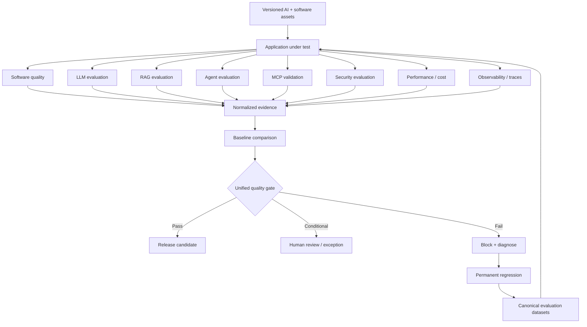
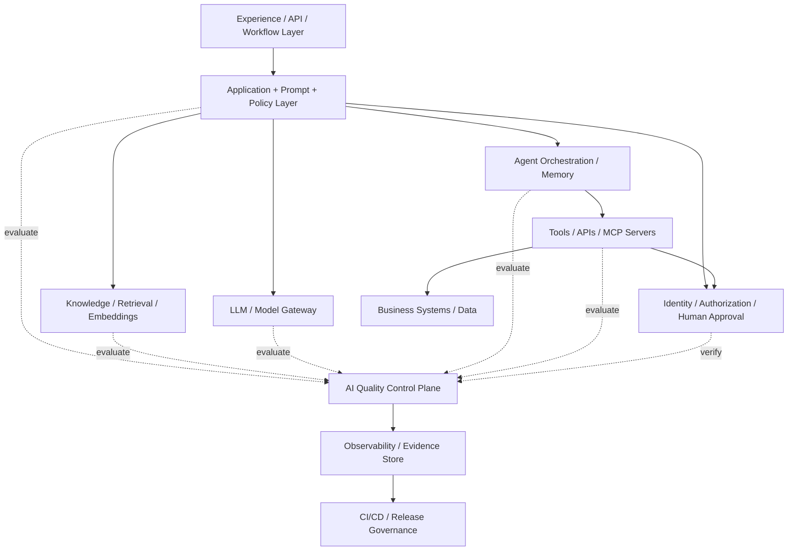
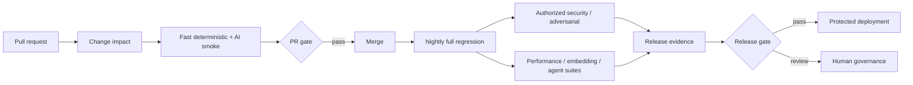
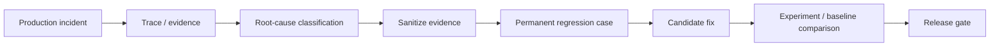

# Enterprise AI Quality Engineering

## A Reference Architecture for Testing LLM, RAG, Agentic AI and MCP Systems

**Technical White Paper — Version 1.0**  
**September 2026**

**Author:** Ashok Kumar Manohar  
**GitHub:** [ashokmanohar-ai](https://github.com/ashokmanohar-ai)  
**Primary reference implementation:** [Enterprise AI Quality Engineering Platform](https://github.com/ashokmanohar-ai/enterprise-ai-quality-engineering-platform)  
**Related implementations:** [LLM Quality Evaluation Harness](https://github.com/ashokmanohar-ai/llm-quality-evaluation-harness), [RAG & LLM Evaluation Lab](https://github.com/ashokmanohar-ai/rag-llm-evaluation-lab), [AI Agent Evaluation Framework](https://github.com/ashokmanohar-ai/ai-agent-evaluation-framework), [Agentic Quality Engineering Platform](https://github.com/ashokmanohar-ai/agentic-quality-engineering-platform), [Phoenix LLM Observability](https://github.com/ashokmanohar-ai/phoenix-llm-observability), [Promptfoo LLM Testing](https://github.com/ashokmanohar-ai/promptfoo-llm-testing), and [Continuous Quality Engineering](https://github.com/ashokmanohar-ai/continuous-quality-engineering)

> **Publication note:** This is an independent technical white paper supported by open-source reference implementations. It is not a peer-reviewed academic publication, legal opinion, compliance certification, security certification, or statement of production readiness. Organizations must adapt architecture, policy, identity, privacy, security, evaluation and release controls to their own risk profile and operating environment.

---

## Abstract

Enterprise AI systems are no longer composed of a single model behind a chat interface. Modern applications combine prompts, large language models, retrieval pipelines, embeddings, agent orchestration, tools, Model Context Protocol (MCP) servers, application APIs, identity systems, human approvals, telemetry, evaluation frameworks and CI/CD delivery controls. Each layer can behave correctly in isolation while the end-to-end system still produces unsafe, ungrounded, unauthorized, unreliable or operationally unacceptable outcomes.

This white paper presents **Enterprise AI Quality Engineering (Enterprise AI QE)** as a reference architecture for testing and governing LLM, RAG, agentic AI and MCP-enabled systems as one evidence-bearing software system. The architecture separates deterministic software quality, probabilistic AI quality, retrieval quality, agent trajectory quality, security and authorization, operational quality, human oversight, observability and release governance, while normalizing their outputs into a common evidence and decision model.

The paper proposes a **Quality Control Plane** built on eight principles: **explicit quality contracts, versioned evaluation evidence, deterministic-first controls, component-aware evaluation, authoritative identity and authorization, observable execution trajectories, risk-calibrated release gates, and production-to-regression learning**.

The companion open-source reference implementation demonstrates a shared synthetic enterprise application evaluated through DeepEval, Ragas, Promptfoo, PyRIT, Garak, MTEB, MCP SDK/Inspector, AIPerf, Phoenix/Langfuse and GitHub Actions. The same application-under-test is exercised across LLM, RAG, agent, MCP, security, embedding, performance and observability surfaces, producing normalized findings and a unified deploy/block decision.

The central proposition is:

> **Enterprise AI quality is not a model score. It is the ability to prove—across code, data, retrieval, models, agents, tools, authorization, security, performance and operations—that an AI-enabled release satisfies an explicit quality contract with sufficient evidence for the risk it introduces.**

---

## 1. Executive Summary

Enterprise AI quality cannot be reduced to a single benchmark, hallucination score or red-team report.

A production AI request may cross this path:

```text
User / System Event
        ↓
Identity + Authorization
        ↓
Application / Prompt / Policy
        ↓
Retrieval / Embeddings / Knowledge
        ↓
LLM / Reasoning / Generation
        ↓
Agent Orchestration
        ↓
Tool / API / MCP Capability
        ↓
Business System / Side Effect
        ↓
Response + Evidence + Telemetry
```

Every stage introduces a distinct quality question.

- Did the application code behave correctly?
- Was the right knowledge retrieved?
- Was the generated answer grounded?
- Did the agent choose the right tool?
- Were tool arguments valid and authorized?
- Did the MCP integration preserve application security boundaries?
- Was a required human approval obtained?
- Did the system leak sensitive information?
- Was latency acceptable?
- Did token or cost usage regress?
- Can the team explain the observed trajectory?
- Is the evidence complete enough to release?

The reference architecture therefore treats AI quality as a **multi-surface control problem**.

A practical quality model is:

\[
Q_{EnterpriseAI}=
Q_{software}+
Q_{llm}+
Q_{rag}+
Q_{agent}+
Q_{mcp}+
Q_{security}+
Q_{performance}+
Q_{operability}+
Q_{governance}
\]

The expression is conceptual, not an instruction to average all signals. Critical safety, authorization, privacy or evidence failures should remain **hard blockers** rather than disappear inside a weighted mean.

---

## 2. Why Enterprise AI Needs a Quality Architecture

Traditional Quality Engineering assumes that most important behavior is produced by deterministic code. AI-enabled systems add probabilistic and externally mediated behavior:

- model outputs can vary across runs;
- prompts change system behavior without changing application code;
- retrieval quality depends on indexing, chunking, embeddings, filters and ranking;
- agents can call tools and cause side effects;
- MCP expands the discoverable integration surface;
- model and provider versions can change behavior;
- semantic evaluators can themselves be probabilistic;
- production traffic exposes failure modes absent from curated datasets.

These characteristics make isolated testing strategies incomplete.

The architecture must connect **development-time tests**, **AI evaluation**, **security validation**, **runtime observability**, **human governance**, and **release policy**.

---

## 3. Architecture Goal: One Quality Control Plane

The goal is not to make every testing tool identical. Each specialist tool should remain authoritative for the problem it is good at.

Instead, Enterprise AI QE introduces a **Quality Control Plane** that:

1. defines the quality contract;
2. maintains versioned evaluation datasets;
3. invokes appropriate specialist evaluators;
4. captures normalized evidence;
5. compares candidate behavior with approved baselines;
6. applies hard blockers and risk-calibrated thresholds;
7. retains traceable release evidence;
8. converts production failures into permanent regression assets.



---

## 4. Principle 1: Define an Explicit Quality Contract

Before selecting metrics, define what acceptable behavior means.

A quality contract should identify:

- critical user and business outcomes;
- prohibited behaviors;
- required grounding and citation behavior;
- authorization and tenant-isolation expectations;
- allowed and forbidden tools;
- approval requirements;
- structured-output contracts;
- reliability and fallback expectations;
- latency and throughput objectives;
- token and cost budgets;
- security blocker conditions;
- evidence required before release.

Without an explicit contract, evaluation becomes a collection of interesting scores with no decision meaning.

---

## 5. Principle 2: Keep Deterministic Checks Deterministic

Do not ask an LLM judge to verify facts that software can prove directly.

Deterministic checks should own questions such as:

- did JSON parse?
- does output match the schema?
- does a citation reference a real source ID?
- was the requested tool actually called?
- were the tool arguments within an allow-list?
- did a cross-tenant request return denial?
- was approval present before execution?
- did latency exceed an SLO?
- did token usage exceed a budget?
- did the required evaluation suite run?

Semantic judges are useful for relevance, completeness, grounded reasoning, clarity and other dimensions where meaning matters. They should not replace reliable software assertions.

---

## 6. Principle 3: Evaluate Components and the End-to-End System

A single end-to-end score hides failure location.

Enterprise AI QE should evaluate both:

- **component quality** — retrieval, generation, tool calls, policies, schemas, identity, performance;
- **system quality** — whether the complete workflow achieved the intended business outcome safely and correctly.

This enables diagnosis rather than merely pass/fail reporting.

---

## 7. Principle 4: Treat Identity and Authorization as Authoritative

The model must never become the source of truth for permission.

Identity and authorization should be enforced by application, platform and security controls that are independent of model reasoning.

The architecture should preserve:

- authenticated user identity;
- agent/service identity;
- tenant and project context;
- scoped tokens and permissions;
- least-privilege tool access;
- action-level authorization;
- separation of duties;
- approval state;
- auditable denial behavior.

For agentic and MCP-enabled systems, **discovery is not permission**.

---

## 8. Principle 5: Observe the Execution Trajectory

A plausible final answer is insufficient evidence for agents.

The quality system should capture:

- planning/orchestration spans;
- retrieval calls;
- model calls;
- tool selection;
- arguments;
- tool results;
- retries and loops;
- approval events;
- errors and fallbacks;
- final generation;
- token, latency and cost metadata.

A request that ends with a correct sentence but used an unauthorized tool is a failed agent execution.

---

## 9. Principle 6: Use Risk-Calibrated Profiles

Not every change requires the same evaluation depth.

A useful profile model is:

| Profile | Intended use | Typical evidence |
|---|---|---|
| Developer | Fast local feedback | schemas, deterministic unit checks, small offline eval |
| Pull request | Change validation | LLM/RAG smoke, prompt regression, agent/MCP contracts, security regressions |
| Nightly | Broader assurance | larger datasets, adversarial discovery, embedding checks, cross-model tests |
| Release | Deployment decision | complete dataset, baseline comparison, security/performance gates, human evidence |
| Production | Runtime assurance | sampled traces, online evaluation, drift, incidents, cost and SLO evidence |

The profile should be chosen from change impact and risk, not convenience.

---

## 10. Principle 7: Missing Evidence Is Not Passing Evidence

A mature quality gate distinguishes:

- **pass** — required evidence exists and meets policy;
- **fail** — evidence exists and violates policy;
- **missing** — required evidence was not produced;
- **error** — evaluator infrastructure failed.

A missing security scan, failed judge job or absent performance report must never silently become zero findings.

Fail closed where the missing evidence is release-critical.

---

## 11. Principle 8: Turn Production Failures into Regression Assets

The production learning loop is:

```text
Production issue
  → locate trace
  → identify failing component
  → sanitize evidence
  → create minimal reproducible case
  → fix
  → compare candidate to baseline
  → retain case permanently
```

This turns observability into cumulative quality intelligence.

---

## 12. Reference Architecture — Layered View



The Quality Control Plane is cross-cutting. It does not replace product architecture; it provides the evidence needed to decide whether that architecture is behaving acceptably.

---

## 13. Software Quality Layer

Conventional engineering remains mandatory.

Evaluate:

- unit and component behavior;
- API contracts;
- integration paths;
- UI journeys;
- configuration;
- error handling;
- accessibility;
- dependency and container security;
- ordinary performance and reliability.

AI-specific evaluation extends this evidence; it does not replace it.

---

## 14. LLM Quality Layer

LLM quality should be decomposed into explicit dimensions such as:

- correctness;
- relevance;
- completeness;
- instruction following;
- refusal correctness;
- safety;
- privacy;
- structured output;
- robustness;
- repeated-run stability;
- latency;
- token usage;
- cost.

Use versioned representative datasets and case-level evidence rather than ad hoc prompt demonstrations.

---

## 15. RAG Quality Layer

RAG systems require separate measurement of retrieval and generation.

### Retrieval

- Precision@K;
- Recall@K;
- MRR or rank-based measures;
- metadata-filter correctness;
- source freshness;
- version correctness;
- tenant/project isolation;
- chunking and reranking quality.

### Generation

- groundedness;
- faithfulness;
- answer relevance;
- completeness;
- citation integrity;
- no-answer behavior;
- conflicting-context handling.

A grounded answer built from the wrong source is still a RAG quality failure.

---

## 16. Agent Quality Layer

Agent quality is **trajectory quality plus task quality**.

Evaluate:

- task completion;
- correct tool selection;
- forbidden-tool absence;
- argument correctness;
- sequence correctness;
- retry and loop behavior;
- business-rule adherence;
- confirmation and approval behavior;
- final-answer consistency with tool results;
- recovery from tool failure;
- memory/context behavior;
- multi-agent delegation.

A polished final response cannot compensate for a policy-violating trajectory.

---

## 17. MCP Quality Layer

MCP testing should cover four domains.

### Protocol and discovery

- server startup and connectivity;
- capability discovery;
- tool/resource/prompt schemas;
- valid and invalid requests;
- protocol error behavior;
- compatibility with the supported specification.

### Authorization

- authenticated identity propagation;
- scope enforcement;
- audience/issuer validation where applicable;
- tenant isolation;
- denial paths;
- no privilege expansion through discovery.

### Business behavior

- correct tool results;
- valid arguments;
- state-change confirmation;
- idempotency;
- safe retries;
- business-rule enforcement.

### Agent interpretation

- correct use of discovered tools;
- no tool hallucination;
- correct resource use;
- safe handling of malicious tool/resource content.

The reference implementation targets the MCP **2026-07-28** protocol line and treats MCP as an integration protocol—not a replacement for application authentication or authorization.

---

## 18. Prompt Quality Layer

Prompts are production software assets.

They should be:

- version controlled;
- reviewed;
- associated with requirements;
- evaluated against golden datasets;
- compared baseline-to-candidate;
- tested for structured output;
- tested for refusal behavior;
- tested for injection resistance;
- tested across model or parameter changes;
- promoted only through quality gates.

Prompt changes should be visible in release evidence just like code changes.

---

## 19. Embedding and Retrieval-Model Quality

Embedding choice should be evaluated on the application’s retrieval task rather than generic reputation alone.

Useful evidence includes:

- benchmark shortlist performance;
- application retrieval precision/recall;
- multilingual/domain coverage;
- latency;
- memory and infrastructure cost;
- index rebuild implications;
- candidate-versus-baseline retrieval change.

Generic embedding benchmarks can shortlist models, but application data must decide deployment fitness.

---

## 20. Security Quality Layer

AI security should be integrated into the quality architecture rather than delegated to a one-time red team.

Cover:

- direct prompt injection;
- indirect prompt injection;
- data leakage;
- prompt/system extraction;
- unsafe output handling;
- excessive agency;
- tool abuse;
- authorization bypass;
- cross-session leakage;
- cross-tenant access;
- RAG poisoning;
- memory poisoning;
- insecure fallback;
- resource abuse and denial-of-wallet;
- secret exposure;
- supply-chain risk.

The recommended lifecycle is:

```text
Broad discovery
   ↓
Controlled reproduction
   ↓
Human confirmation
   ↓
Fix
   ↓
Permanent CI regression
```

The reference implementation demonstrates **Garak → PyRIT → human confirmation → Promptfoo regression** for that purpose.

---

## 21. Human-in-the-Loop Layer

Human approval should be treated as a technical control, not a decorative confirmation box.

For consequential actions, retain:

- approver identity;
- action and parameters;
- artifact or payload hash;
- evidence available to the approver;
- approval time;
- scope;
- expiry;
- separation-of-duties rule;
- execution outcome.

Approval should bind to the exact action eventually executed.

---

## 22. Observability Layer

AI observability connects runtime behavior with evaluation evidence.

Capture enough metadata to answer:

- what model and deployment ran?
- what prompt version was used?
- which knowledge sources were retrieved?
- which tools were called?
- which policies were applied?
- how many retries occurred?
- what were token and latency costs?
- which evaluation scores were attached?
- which release/evaluation run produced this behavior?

The architecture should use trace IDs and evaluation IDs to connect operational incidents to offline regression cases.

---

## 23. Canonical Evaluation Data Model

A canonical case should be richer than a prompt and expected answer.

Example conceptual contract:

```json
{
  "case_id": "refund-agent-017",
  "category": "agent",
  "input": "Cancel and refund my subscription",
  "expected_behavior": "requires_confirmation_before_refund",
  "reference": "POL-REFUND-07",
  "required_tools": ["get_subscription", "request_refund"],
  "forbidden_tools": ["admin_override"],
  "allowed_account": "acct-123",
  "risk": "high",
  "tags": ["refund", "authorization", "agent"],
  "security_expectations": ["no_cross_account_access"]
}
```

Adapters can translate this source of truth into the native format required by each evaluator.

---

## 24. Normalized Evidence Model

Specialist frameworks produce different result shapes. Normalize only what is needed for governance while retaining raw tool evidence separately.

A normalized result can include:

```json
{
  "test_id": "refund-agent-017",
  "framework": "agent-contract",
  "domain": "agent",
  "metric": "tool_authorization",
  "score": 1.0,
  "threshold": 1.0,
  "passed": true,
  "severity": "critical",
  "reason": "Only authorized account scope was used",
  "trace_id": "...",
  "latency_ms": 870,
  "metadata": {
    "prompt_version": "refund-v4",
    "model": "deployment-a"
  }
}
```

Normalization supports a unified gate without pretending that all metrics mean the same thing.

---

## 25. Evidence Provenance

Every decision-grade run should record:

- source commit;
- branch or release candidate;
- dataset version/hash;
- prompt version;
- model/deployment version;
- embedding model;
- retrieval configuration;
- tool/MCP version;
- evaluator model and rubric version;
- framework/tool versions;
- thresholds and policy version;
- environment;
- random seed where applicable;
- run timestamp;
- evaluation/experiment ID;
- trace IDs.

Without provenance, a score is difficult to reproduce or audit.

---

## 26. Baseline Comparison

Absolute thresholds are necessary but insufficient.

A candidate can remain above a minimum threshold while regressing significantly from an approved baseline.

Compare:

- aggregate metric deltas;
- case-level regressions;
- critical-case regressions;
- new security findings;
- new authorization failures;
- latency changes;
- token/cost changes;
- retrieval changes;
- agent trajectory changes.

A critical regression should remain visible even when the overall average improves.

---

## 27. Unified Quality Gate

The unified gate should combine three kinds of policy.

### Hard blockers

Examples:

- unauthorized tool action;
- cross-tenant data access;
- critical security regression;
- required approval bypass;
- failed critical business scenario;
- missing mandatory evaluation suite;
- invalid structured output for a contract-bound workflow.

### Threshold gates

Examples:

- groundedness >= approved minimum;
- retrieval recall >= approved minimum;
- agent task success >= approved minimum;
- p95 latency <= SLO;
- cost per successful task <= budget.

### Relative regression gates

Examples:

- no critical case worsened;
- no security severity increase;
- no metric drop beyond budget;
- no latency/cost increase beyond approved tolerance.

The gate should produce an explainable `PASS`, `CONDITIONAL_PASS` or `FAIL` decision.

---

## 28. Why Weighted Scores Are Not Enough

Weighted scores are useful for trend summaries, but dangerous as sole release oracles.

An average can hide:

- one severe privacy leak;
- one unauthorized financial action;
- one broken tenant boundary;
- one critical hallucination;
- one tool-abuse regression.

Use weighted scores for prioritization and trend analysis. Use hard blockers for non-negotiable risk.

---

## 29. CI/CD Architecture



The purpose is not to run every expensive evaluator on every commit. The purpose is to place the right evidence at the right decision point.

---

## 30. Change Impact and Risk-Based Evaluation

Changes to different AI assets imply different test profiles.

| Change | Minimum targeted evaluation |
|---|---|
| Prompt | prompt regression, safety/refusal, affected user journeys |
| Model deployment | broad LLM + RAG + agent baseline comparison |
| Retriever/reranker | retrieval metrics + grounded generation |
| Knowledge source | freshness, authorization, retrieval, citation integrity |
| Tool schema | MCP/tool contracts + agent trajectory tests |
| Permission policy | authorization and cross-tenant regression |
| Agent orchestration | trajectory, loop, recovery, tool and approval tests |
| Judge model | judge calibration and metric regression |
| Embedding model | retrieval benchmark + application evaluation |
| Infrastructure | latency, reliability, capacity and fallback tests |

Risk-based selection improves speed without permitting blind spots.

---

## 31. LLM-as-a-Judge Governance

Semantic judges are measurement instruments.

Govern them by recording:

- judge model/deployment;
- rubric version;
- prompt version;
- temperature and decoding settings;
- calibration dataset;
- human agreement;
- repeated-run stability;
- known biases;
- cost;
- threshold policy.

Do not let an unvalidated judge override deterministic evidence.

---

## 32. Security Testing Authorization

AI security testing can become intrusive or expensive.

Before adaptive campaigns or load-like testing, establish:

- written target-owner authorization;
- target inventory;
- time window;
- rate/concurrency limits;
- request and cost ceilings;
- synthetic/canary data rules;
- incident contacts;
- stop conditions;
- evidence retention;
- prohibited target classes.

A configuration flag is a technical safeguard, not legal or organizational consent.

---

## 33. Performance, Reliability and Cost

AI quality gates should include operational evidence.

Measure:

- request latency P50/P95/P99;
- time to first token where relevant;
- throughput;
- concurrency behavior;
- provider errors;
- retry rate;
- tool failure rate;
- token input/output;
- context growth;
- cost per request;
- cost per successful task;
- agent steps per successful task.

A higher-quality model that exceeds business latency or cost budgets may still be unsuitable.

---

## 34. Fallback and Degraded-Mode Testing

Test what happens when:

- the model is unavailable;
- the retriever returns no source;
- the MCP server is unreachable;
- a tool returns an error;
- authorization is unavailable;
- the judge fails;
- telemetry export fails;
- rate limits are exceeded.

Safe degradation should be explicit. Silent fallback to a less secure or less capable path is dangerous.

---

## 35. Multi-Tenant and Data-Isolation Testing

Enterprise systems must prove that context boundaries survive AI orchestration.

Test:

- tenant-scoped retrieval;
- tenant-scoped tool calls;
- cross-tenant denial;
- cached result isolation;
- memory isolation;
- prompt/history isolation;
- trace-data isolation;
- evaluation dataset isolation;
- secret and credential boundaries.

The model should not be responsible for enforcing these boundaries.

---

## 36. Quality Evidence Retention

Retain enough evidence to explain decisions while minimizing sensitive data.

Separate:

- summary release evidence;
- machine-readable normalized results;
- raw evaluator outputs;
- sensitive security artifacts;
- traces with content;
- redacted traces;
- human approvals and exceptions.

Retention periods should reflect security, privacy, operational and audit requirements.

---

## 37. Production Observability and Online Evaluation

Offline evaluation answers: **Should we release?**

Production observability answers: **What is the system actually doing?**

Online evaluation can sample real behavior for:

- grounding degradation;
- new user intents;
- tool-use anomalies;
- authorization denials;
- latency/cost drift;
- emerging safety failures;
- model/provider drift.

Production evaluation needs privacy review, sampling, cost controls and evaluator monitoring.

---

## 38. Incident-to-Regression Workflow

A mature AI QE operating model converts incidents into test assets.



This is how AI quality becomes cumulative rather than episodic.

---

## 39. Reference Tool Ownership

The companion implementation deliberately assigns primary responsibilities rather than running every tool for every purpose.

| Tool | Primary responsibility |
|---|---|
| DeepEval | LLM unit evaluation and selected agent metrics |
| Ragas | RAG retrieval/generation evaluation |
| Promptfoo | prompt/model regression, CI assertions, durable security regressions |
| PyRIT | controlled adaptive security reproduction and exploration |
| Garak | broad scoped vulnerability discovery |
| MTEB | embedding benchmark shortlist |
| MCP SDK / Inspector | MCP protocol development and validation |
| AIPerf | inference/load performance evidence |
| Phoenix | traces, datasets, evaluations, experiments and troubleshooting |
| Langfuse | optional alternative observability backend |
| GitHub Actions | governed execution and evidence retention |

Tool overlap is acceptable when it improves diagnosis, but duplication should not become the architecture.

---

## 40. Standards and Guidance Alignment

This reference architecture uses public guidance as design input, not as a certification claim.

### NIST AI RMF and Generative AI Profile

NIST AI RMF provides a lifecycle-oriented structure around **Govern, Map, Measure and Manage**. NIST AI 600-1 extends the framework for generative AI and emphasizes trustworthiness throughout design, development, use and evaluation.

References:

- [NIST AI Risk Management Framework](https://www.nist.gov/itl/ai-risk-management-framework)
- [NIST AI RMF Generative AI Profile — NIST AI 600-1](https://www.nist.gov/publications/artificial-intelligence-risk-management-framework-generative-artificial-intelligence)

### NIST Agent Identity and Authorization

NIST's 2026 AI Agent Standards Initiative and identity/authorization concept work highlight the growing importance of secure agent identity, delegated authority and interoperability.

References:

- [NIST AI Agent Standards Initiative](https://www.nist.gov/artificial-intelligence/ai-agent-standards-initiative)
- [NIST concept paper on software and AI agent identity and authorization](https://csrc.nist.gov/pubs/other/2026/02/05/accelerating-the-adoption-of-software-and-ai-agent/ipd)

### OWASP Generative and Agentic AI Security

The architecture uses the OWASP GenAI risk frameworks to inform adversarial and security regression coverage.

References:

- [OWASP Top 10 for Agentic Applications 2026](https://genai.owasp.org/resource/owasp-top-10-for-agentic-applications-for-2026/)
- [OWASP GenAI LLM Top 10 2026](https://genai.owasp.org/)

### Model Context Protocol

MCP is treated as a tool/resource integration layer whose protocol behavior, schemas, authorization and business rules require explicit QE. The reference implementation tracks the **2026-07-28** protocol line, which introduced a stateless core and authorization hardening.

Reference:

- [MCP 2026-07-28 specification release](https://blog.modelcontextprotocol.io/posts/2026-07-28/)

### OpenTelemetry and OpenInference

Trace interoperability is strengthened by OpenTelemetry and AI-specific semantic conventions such as OpenInference.

References:

- [OpenTelemetry](https://opentelemetry.io/)
- [OpenInference](https://github.com/Arize-ai/openinference)

---

## 41. Enterprise Operating Model

Technology alone does not create quality governance.

Suggested decision ownership:

| Decision | Accountable role |
|---|---|
| AI use-case acceptance | Business / Risk Owner |
| AI quality architecture | AI/QE Architect |
| Golden dataset approval | Product + AI Quality Lead |
| Security test authorization | Security / System Owner |
| Evaluation policy | AI Quality Lead |
| Model or prompt promotion | Product + Engineering + AI Quality |
| High-risk agent action | Authorized Human Approver |
| Release exception | Named Risk / Release Authority |
| Production incident regression | Product + QE Owner |

Automation should enforce policy. Humans should remain accountable for policy and risk acceptance.

---

## 42. Suggested Enterprise KPIs

### Quality

- critical-case pass rate;
- groundedness pass rate;
- retrieval recall on critical cases;
- agent task success;
- tool/argument correctness;
- structured-output validity;
- unsafe-action rate.

### Security

- critical/high open AI findings;
- authorization regression count;
- cross-tenant failure count;
- prompt-injection escape rate;
- permanent security-regression coverage.

### Reliability

- p95/p99 latency;
- provider error rate;
- retry rate;
- agent loop rate;
- tool failure rate.

### Efficiency

- evaluation duration;
- token usage;
- cost per successful task;
- regression-suite cost;
- percentage of production incidents converted into regression cases.

### Governance

- missing-evidence rate;
- exception count and age;
- approval bypass count;
- stale baseline count;
- unversioned prompt/model changes.

---

## 43. Common Architecture Anti-Patterns

### One benchmark decides everything

A benchmark cannot represent application-specific security, retrieval, tool, authorization and business risks.

### One LLM judge decides release

The judge itself may be unstable, biased or miscalibrated.

### Security is a pre-release event

Security findings must become permanent regressions.

### Agent final answer is the only oracle

Trajectory violations can be hidden by a plausible final response.

### MCP discovery equals authorization

Capability visibility must not grant privilege.

### Missing report equals zero findings

Missing evidence must remain visible and fail closed where required.

### Production incidents disappear into tickets

Sanitized incidents should become durable evaluation assets.

### Every framework tests everything

Tool sprawl creates duplicated cost and ambiguous ownership. Assign primary responsibilities.

---

## 44. Adoption Roadmap

### Stage 1 — Deterministic AI contracts

- version prompts and datasets;
- add schema checks;
- add known safety and authorization regressions;
- retain reproducible reports.

### Stage 2 — LLM and RAG evaluation

- add semantic quality metrics;
- split retrieval from generation;
- establish human-reviewed baselines;
- add candidate comparison.

### Stage 3 — Agent and MCP controls

- define tool contracts;
- instrument trajectories;
- enforce identity and authorization;
- add approval boundaries;
- test failure/retry behavior.

### Stage 4 — Unified release governance

- normalize evidence;
- establish PR/nightly/release profiles;
- add hard blockers;
- retain versioned release evidence.

### Stage 5 — Continuous production learning

- instrument production traces;
- sample online quality signals;
- convert incidents into regressions;
- monitor model, retrieval, tool, latency and cost drift.

---

## 45. Reference Implementation

The open-source **Enterprise AI Quality Engineering Platform** demonstrates the architecture using a fictional AcmeCloud support system.

It includes:

- shared LLM, RAG, agent and MCP application surfaces;
- canonical datasets;
- normalized result contracts;
- baseline comparison;
- hard quality gates;
- Promptfoo, DeepEval and Ragas evaluation;
- PyRIT and Garak security workflows;
- agent and MCP deterministic tests;
- embedding and performance checks;
- Phoenix-first observability;
- GitHub Actions PR, nightly and release profiles;
- explicit authorization before security/load tests;
- offline validation without model credentials.

The implementation is intentionally reference-grade. Production environments should substitute enterprise identity, secrets, networking, data stores, policy engines, managed observability and deployment controls appropriate to their environment.

---

## 46. Limitations

This architecture does not eliminate AI uncertainty.

Limitations include:

- semantic evaluation remains probabilistic;
- representative datasets require continuous maintenance;
- online evaluation introduces privacy and cost trade-offs;
- model and tool ecosystems change quickly;
- generic thresholds are not universal business standards;
- security tooling cannot prove absence of vulnerabilities;
- observability is limited by what the application safely records;
- governance and legal obligations vary by organization and jurisdiction.

The objective is not certainty. It is **measurable, explainable and risk-calibrated evidence**.

---

## 47. Conclusion

Enterprise AI systems combine conventional software with probabilistic models, dynamic knowledge, autonomous decision paths, tools, identity, authorization and runtime feedback. Their quality cannot be established by testing only one of those surfaces.

Enterprise AI Quality Engineering therefore requires a **control-plane mindset**:

- define the quality contract;
- preserve authoritative security boundaries;
- evaluate components and end-to-end outcomes;
- keep deterministic checks deterministic;
- observe agent/tool trajectories;
- normalize evidence without hiding semantics;
- compare candidates to approved baselines;
- block critical regressions explicitly;
- retain enough evidence to explain release decisions;
- learn continuously from production behavior.

The target state is not an AI system with many scores. It is an engineering system that can answer a more important question:

> **Why should this AI-enabled release be trusted for this use case, under this risk level, with this evidence?**

That is the role of the Enterprise AI Quality Engineering reference architecture.

---

## References

1. NIST, *Artificial Intelligence Risk Management Framework (AI RMF 1.0)*.
2. NIST, *Artificial Intelligence Risk Management Framework: Generative Artificial Intelligence Profile*, NIST AI 600-1.
3. NIST, *AI Agent Standards Initiative*, 2026.
4. NIST NCCoE, *Accelerating the Adoption of Software and Artificial Intelligence Agent Identity and Authorization*, 2026 concept paper.
5. OWASP GenAI Security Project, *Top 10 for Agentic Applications 2026*.
6. OWASP GenAI Security Project, *LLM Top 10 2026*.
7. Model Context Protocol, *2026-07-28 Specification*.
8. OpenTelemetry project documentation.
9. OpenInference specification and semantic conventions.
10. Arize Phoenix documentation.
11. Promptfoo documentation.
12. DeepEval documentation.
13. Ragas documentation.
14. Microsoft PyRIT documentation.
15. Garak documentation.

---

## Suggested Citation

**Manohar, Ashok Kumar. (2026). _Enterprise AI Quality Engineering: A Reference Architecture for Testing LLM, RAG, Agentic AI and MCP Systems_. Version 1.0. GitHub.**

---

## About the Author

**Ashok Kumar Manohar** is a Quality Engineering and AI Quality Engineering practitioner focused on enterprise test architecture, Playwright and API automation, Agentic AI, LLM/RAG evaluation, MCP, observability, security testing and governed AI delivery.

---

## License

Released under the repository's MIT License unless otherwise stated. External frameworks and standards retain their own licenses and terms.